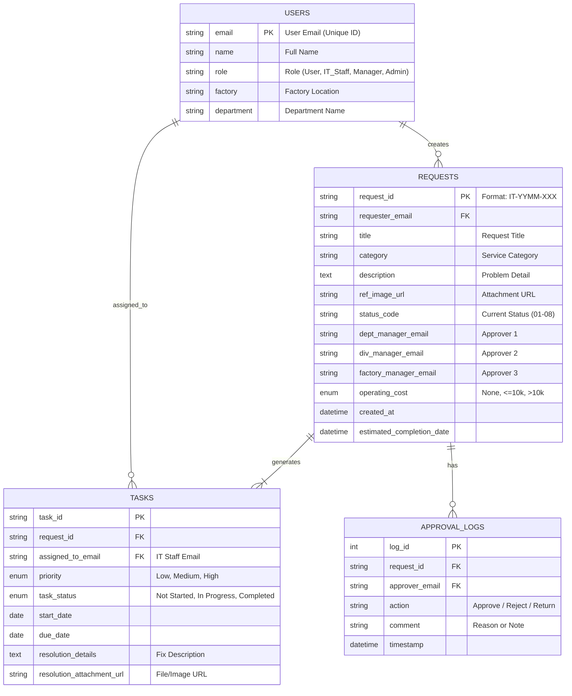
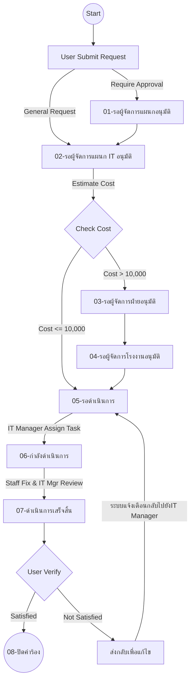

# IT-Request-Management-System
ระบบจัดการคำร้องขอด้าน IT ภายในบริษัทถูกพัฒนาขึ้นเพื่อให้การบันทึกข้อมูล การติดตามสถานะ และการอนุมัติคำร้องขอด้าน IT ภายในบริษัทเป็นไปได้อย่างง่ายดาย ข้อมูลจึงถูกต้องและเป็นปัจจุบันเสมอ ผู้ใช้งานหลายคนสามารถทำงานบนข้อมูลเดียวกันได้ในเวลาเดียวกัน

## โปรเจกต์: IT-Request-Management-System
 

##  Executive Summary (สรุปภาพรวมในมุม Data)
 Application นี้ถูกพัฒนาขึ้นเพื่อแก้ปัญหาความล่าช้าและความผิดพลาดจากการจัดการคำร้องแบบเดิม (Manual Process) ระบบนี้ช่วยให้พนักงานสามารถส่งคำร้อง ติดตามสถานะ และได้รับการอนุมัติอย่างรวดเร็ว

จุดเด่นสำคัญคือการรองรับได้หลายคน ทำให้เจ้าหน้าที่ IT และผู้เกี่ยวข้องสามารถทำงานบนฐานข้อมูลเดียวกันได้แบบ Real-time ข้อมูลจึงมีความถูกต้อง (Accuracy) และเป็นปัจจุบันเสมอ (Up-to-date)

---

##  The Business Challenge & Data Gap
ก่อนเริ่มพัฒนาระบบ กระบวนการแจ้งปัญหา IT อาศัยการสื่อสารผ่านหลายช่องทาง (เช่น อีเมล, ไลน์, หรือปากต่อปาก) และการกรอกแบบฟอร์มกระดาษ ซึ่งก่อให้เกิดปัญหาสำคัญ:
* **Lack of Visibility:** ผู้แจ้งไม่ทราบสถานะงานของตนเองว่าดำเนินการถึงขั้นตอนไหน
* **High Turnaround Time:** กระบวนการอนุมัติล่าช้าเนื่องจากต้องรอเอกสารวิ่งตามลำดับขั้น
* **Lost Requests:** คำร้องบางรายการตกหล่นหรือสูญหายระหว่างทาง

##  Data Architecture & Modeling 
> *Note: เนื่องจากข้อมูลจริงเป็นความลับของบริษัท แผนภาพด้านล่างจึงเป็นการจำลองโครงสร้างข้อมูล (Schema Design) ที่ผมออกแบบเพื่อรองรับ Business Logic*

โครงสร้างฐานข้อมูลของระบบ **IT Request Management System** ออกแบบมาให้รองรับความสัมพันธ์แบบ **Relational Database** เพื่อความยืดหยุ่นและการจัดการข้อมูลที่ถูกต้อง (Data Integrity) โดยประกอบด้วย 4 Entity หลัก ดังนี้

##  System Workflow (ขั้นตอนการทำงาน)

---
# Example UI

## Conclusion

**IT Request Management System** ถูกพัฒนาขึ้นเพื่อเพิ่มประสิทธิภาพในการจัดการคำร้องขอด้าน IT ภายในองค์กรให้มีความถูกต้องและเป็นปัจจุบันเสมอ  
โดยเปลี่ยนจากการอนุมัติและติดตามงานแบบเดิม มาสู่ระบบ Digital ที่รองรับการทำงานร่วมกันหลายคน (Multi-user) เต็มรูปแบบ

**สิ่งที่ระบบนี้มอบให้:**
* **Centralized Data:** รวบรวมทุกคำร้องขอ (Requests) และประวัติการแก้ไขไว้ในที่เดียว ง่ายต่อการติดตามสถานะและตรวจสอบข้อมูลย้อนหลัง 
* **Streamlined Workflow:** ลดความสับสนในขั้นตอนการอนุมัติและการมอบหมายงาน (Task Assignment) ด้วยลำดับขั้นที่ชัดเจนตั้งแต่การแจ้งเรื่อง, การประเมินค่าใช้จ่าย จนถึงการปิดงาน 
* **Real-time Decision:** ทีม IT และผู้บริหารสามารถเห็นสถานะงานล่าสุดพร้อมกันผ่าน Dashboard ช่วยให้การบริหารจัดการและการตัดสินใจเป็นไปอย่างรวดเร็ว

โปรเจกต์นี้ไม่เพียงแค่ช่วยลดความผิดพลาดของข้อมูล แต่ยังสร้างมาตรฐานการให้บริการ (Service Standard) และความโปร่งใสในการดำเนินงานของฝ่าย IT อย่างเป็นระบบ

